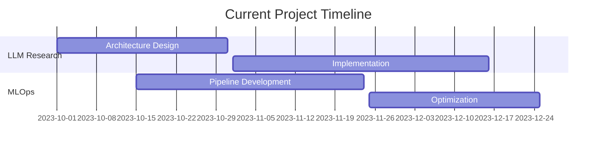

<!-- Header Image -->
<h1 align="center">Hi, I'm London 👋</h1>
<h3 align="center">MLOps Engineer & AI Researcher crafting the future of intelligent systems</h3>

<p align="center">
  <a href="https://yourwebsite.com">Portfolio</a> •
  <a href="https://yourblog.com">Blog</a> •
  <a href="https://twitter.com/yourtwitter">Twitter</a> •
  <a href="https://www.linkedin.com/in/londonparis">LinkedIn</a>
</p>

<!-- Dynamic header SVG animation -->
<div align="center">
  <svg fill="none" viewBox="0 0 800 100" width="800" height="100" xmlns="http://www.w3.org/2000/svg">
      <foreignObject width="100%" height="100%">
          <div xmlns="http://www.w3.org/1999/xhtml">
              <style>
                  @keyframes gradientText {
                      0% { background-position: 0% 50%; }
                      50% { background-position: 100% 50%; }
                      100% { background-position: 0% 50%; }
                  }
                  .container {
                      font-family: system-ui, -apple-system, 'Segoe UI', Roboto, Helvetica, Arial, sans-serif;
                      display: flex;
                      flex-direction: column;
                      align-items: center;
                      justify-content: center;
                      margin: 0;
                      width: 100%;
                      height: 100px;
                  }
                  h1 {
                      font-size: 50px;
                      letter-spacing: 2px;
                      background: linear-gradient(to right, #00ff87, #60efff);
                      -webkit-background-clip: text;
                      background-clip: text;
                      -webkit-text-fill-color: transparent;
                      background-size: 200% auto;
                      animation: gradientText 3s ease infinite;
                  }
              </style>
              <div class="container">
                  <h1>London</h1>
              </div>
          </div>
      </foreignObject>
  </svg>
</div>

<!-- Skill Bars -->
<h3 align="center">💻 Technical Proficiency</h3>
<div align="center">

```
Machine Learning     [█████████████████████░] 95%
System Design       [████████████████████░░] 90%
Distributed Systems [█████████████████████░] 95%
Algorithm Design    [████████████████████░░] 90%
MLOps & DevOps     [██████████████████░░░░] 80%
```

</div>

<!-- GitHub Stats -->
<div align="center">
  
</div>

<!-- Tech Stack -->
<div align="center">
  
</div>

<!-- Featured Projects -->
<div align="center">
  <a href="https://github.com/LLParis/DistributedLLMTraining">
    
  </a>
  <a href="https://github.com/LLParis/QuantitativeTradingSystem">
    
  </a>
</div>

<!-- Project Timeline -->


<!-- GitHub Profile Summary -->
<div align="center">
  
  
</div>

<details>
<summary>🔥 Featured Projects</summary>
<br>
<div align="center">
  <table>
    <tr>
      <td width="50%">
        <h3 align="center">Distributed LLM Training</h3>
        <div align="center">
          <a href="https://github.com/LLParis/DistributedLLMTraining" target="_blank">
            
          </a>
          <p><strong>PyTorch, CUDA, Distributed Systems</strong> - High-performance distributed training framework</p>
        </div>
      </td>
      <td width="50%">
        <h3 align="center">Quantitative Trading System</h3>
        <div align="center">
          <a href="https://github.com/LLParis/QuantitativeTradingSystem" target="_blank">
            
          </a>
          <p><strong>C++, Python, ML</strong> - Low-latency trading infrastructure</p>
        </div>
      </td>
    </tr>
  </table>
</div>
</details>

<p align="center">
  <i>Building the future of AI, one commit at a time.</i>
</p>